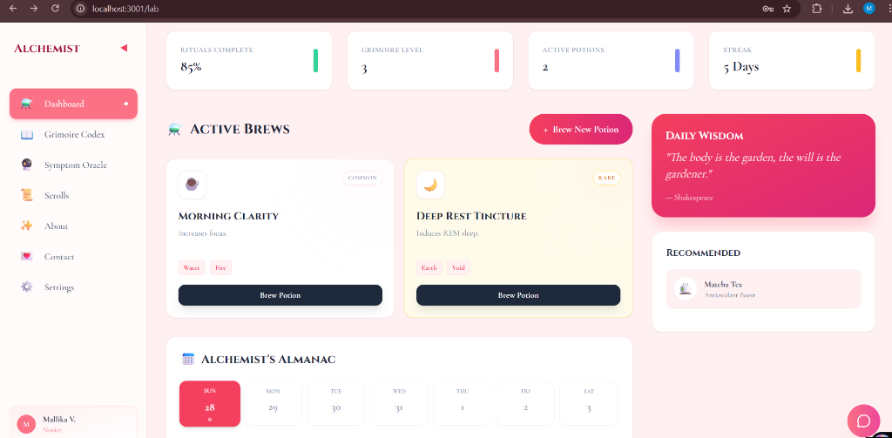

# 🌸 The Alchemist's Grimoire

> *"Where ancient wisdom meets modern science in a sanctuary of clarity."*



LIVE WEBSITE: (https://curecue312.vercel.app/)

## 📖 Overview
**The Alchemist's Grimoire** is a mystical wellness platform designed to help users track their health, brew digital "potions" (wellness rituals), and consult with an AI-powered Oracle. Wrapped in a stunning "Rose Pink" aesthetic, it combines gamification with holistic health management.

## ✨ Key Features

### ⚗️ The Alchemy Lab
*   **Brew Potions**: Create custom wellness rituals (e.g., "Morning Clarity", "Deep Rest Tincture").
*   **Almanac Calendar**: Automatically syncs your brewed potions to a daily schedule.
*   **Visual Tracking**: Monitor your active brews and consistency streak.

### 🔮 AI & Tools
*   **Symptom Oracle**: AI-powered consultation to interpret symptoms and suggest remedies.
*   **Chat Wisps**: A floating AI assistant ready to guide you anytime.
*   **Grimoire Codex**: A library of herbal knowledge and remedies.

### 🎨 Design & Experience
*   **Rose Pink Theme**: A soothing, glassmorphism-inspired UI with gentle animations.
*   **Interactive Elements**: Floating books, magical portals, and fluid transitions using Framer Motion.
*   **Personalized Profile**: Customizable user profiles with "Wizard Ranks" (Novice, Adept, Master).

## 🛠️ Tech Stack
*   **Frontend**: [Next.js 14](https://nextjs.org/) (App Router)
*   **Styling**: Tailwind CSS + Framer Motion
*   **Backend**: Next.js API Routes (Serverless)
*   **Database**: MongoDB (Atlas)
*   **Authentication**: Custom JWT Auth (Salt & Hash)
*   **AI Integration**: Custom LLM API

## 🚀 Getting Started

### Prerequisites
*   Node.js 18+
*   MongoDB Atlas URI

### Installation

1.  **Clone the repository**:
    ```bash
    git clone https://github.com/Mallika-coder/CureCue.git
    cd CureCue
    ```

2.  **Install dependencies**:
    ```bash
    npm install
    ```

3.  **Set up Environment Variables**:
    Create a `.env.local` file in the root directory:
    ```env
    MONGODB_URI=your_mongodb_connection_string
    JWT_SECRET=your_secret_key
    ```

4.  **Run the Alchemist's Server**:
    ```bash
    npm run dev
    ```

5.  Open the portal at `http://localhost:3000`.

## 📜 License
This project is for educational and wellness purposes.

---
*Created with magic by Mallika Verma.*
